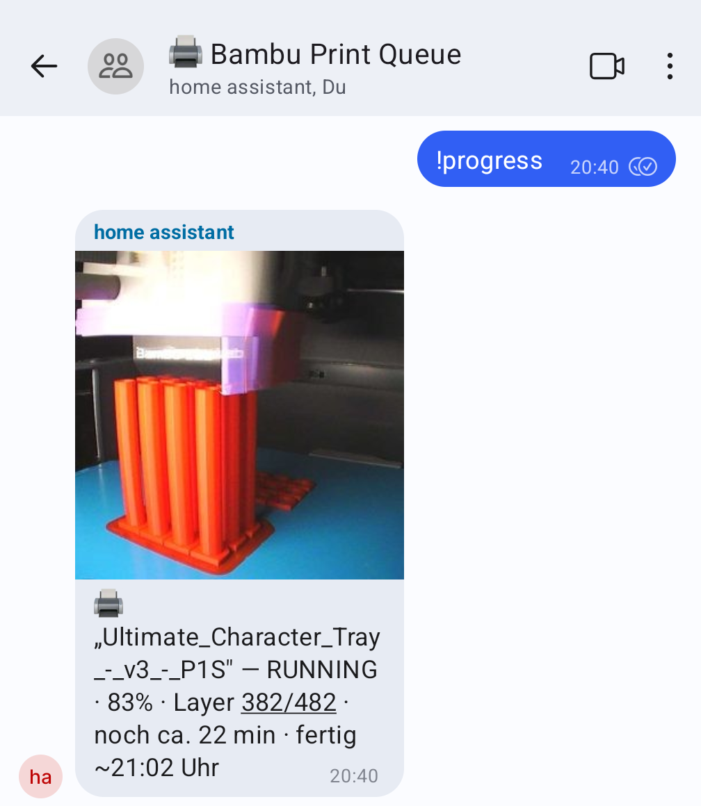
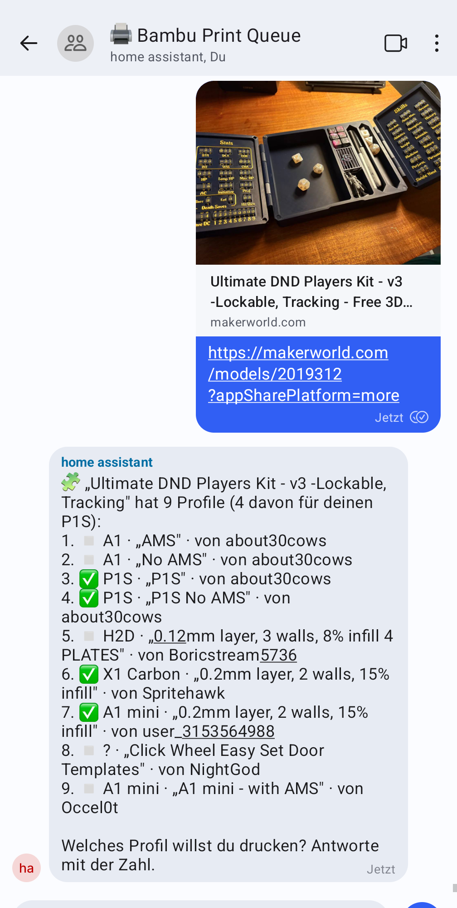
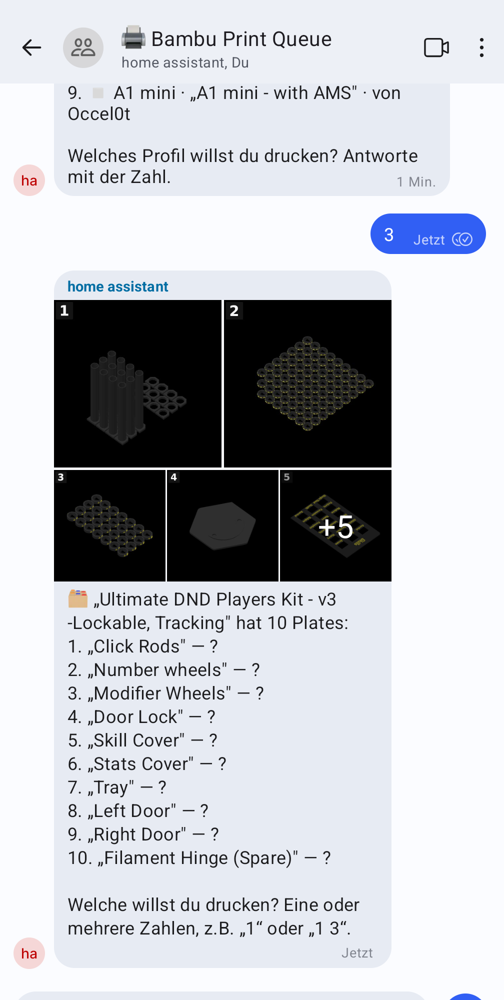
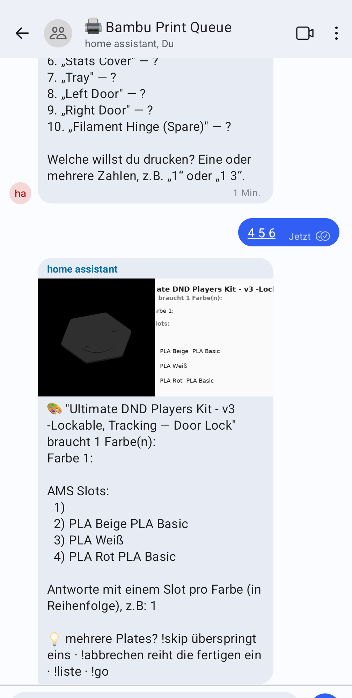
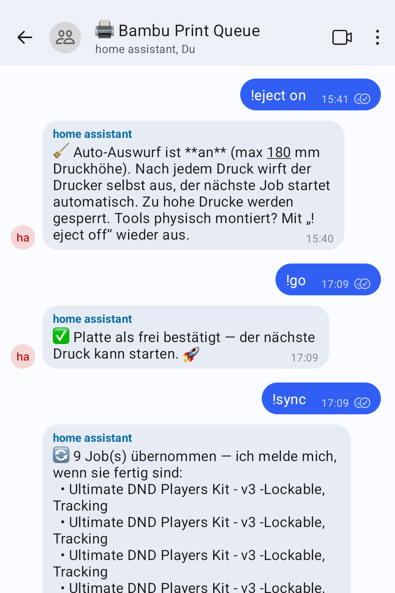

# bambu-bot

Signal-driven 3D-print queue bot. A small HTTP service that an upstream
**dispatcher** — e.g. [signal-router](https://github.com/phieb/signal-router) —
forwards Signal messages to: it answers "is this mine?" via `/claims` and, if so,
does the work via `/receive`. It turns model links **and uploaded files** into
print jobs on [Bambuddy](https://github.com/maziggy/bambuddy), talking back over
a Signal REST API.

<p align="center">
  
</p>

<p align="center"><em><code>!progress</code> — live status (%, layer, ETA) with a fresh camera snapshot.</em></p>

## Flow

```
Signal message → dispatcher → bambu-bot /claims → yes → bambu-bot /receive
                                                 → no  → not handled here
```

Work happens in the sender's **persistent per-person Signal group** (found or
created on first contact). DM intake replies are sent there, never back in the DM.

## Intake sources

All of these end up in the same plate → color → re-slice → queue tail:

- **MakerWorld link** — `resolve` + `import` → library file, then the dialog below.
- **Direct file link** — a URL ending in `.3mf` / `.gcode` / `.stl` / `.zip`
  (any host, no login) is downloaded and run through the file intake.
- **File attachment** — `.3mf` / `.gcode` / `.stl` / `.zip` sent in Signal. The
  bytes are fetched from the Signal REST API (`GET /v1/attachments/{id}`) and
  uploaded into a dedicated **library folder** (`BAMBU_SIGNAL_FOLDER`, created if
  missing).
- **Thingiverse link** — `thingiverse.com/thing:<id>` (needs `THINGIVERSE_TOKEN`):
  the thing's printable files are pulled via the API, bundled into an in-memory
  zip, and run through the zip path. Without a token, Thingiverse links get the
  "send me the file" reply.
- **Other model links** (Printables / Cults3D / MyMiniFactory / Thangs) can't be
  resolved (login-walled) → a friendly reply asks for the file or a direct link.

### File-type handling

- **`.gcode` / `.gcode.3mf`** — already sliced. The bot checks the machine
  markers inside the file (`; machine: P1S`) and **rejects** anything not
  positively identified as P1S gcode — wrong machine (A1, X1, …), unknown, or
  raw gcode without markers. No color dialog; the correct plate index is read
  from the file so the printer doesn't look for a non-existent plate.
- **`.3mf` / `.stl`** — uploaded, then the plate/color dialog. A raw **STL** is
  first **arranged onto the bed** (centered on `BED_SIZE_MM`/2, dropped to Z=0)
  so the slicer doesn't drop an off-origin object. A file with no plates is
  treated as a single one-filament plate.
- **`.zip`** — extracted via Bambuddy; **each extracted file becomes its own
  selectable item** (its own `library_file_id`), so a multi-STL zip behaves like
  a multi-plate 3MF. STLs inside the zip are arranged onto the bed too.

## Dialog state machine

A MakerWorld link runs the full dialog — pick a profile, pick plate(s), pick colors:

<p align="center">
  
  
  
</p>

<p align="center"><em>From a MakerWorld link: <strong>1.</strong> profile (P1S profiles flagged) → <strong>2.</strong> plate(s), numbered thumbnails, multi-select → <strong>3.</strong> colors per filament from the AMS slots.</em></p>

Each step is a **numbered reply**; steps with one option auto-skip:

1. **Profile** — MakerWorld only: if several print profiles, ask which (profiles
   for the configured printer are flagged + counted).
2. **Plate(s) / items** — if more than one, ask which to print (numbered
   thumbnails attached, each stamped with its list position). **Multi-select**
   (`1 3`) is allowed.
3. **Colors** — per selected plate, ask which AMS slot per filament (plate/model
   thumbnail + a generated color swatch attached).

**Collect-then-slice:** with multiple plates, all color choices are gathered
first (stored per plate), then everything is sliced + queued at once with one
summary. Per-plate errors are isolated.

Each plate is **re-sliced for the target printer** (so a MakerWorld X1C slice
doesn't land on a P1S) — one filament preset per plate filament, resolved from
the chosen AMS slot. Custom personal filament presets (`PFUS…`, synced from
non-Bambu spools) are skipped because the slicer sidecar can't parse them; it
falls back to the matching Bambu system preset. Queue items are tagged
`target_model` so they dispatch without relying on Bambuddy's `default_printer_id`.

**Universal safety gate:** before every `POST /queue/` the bot downloads the
container and checks the machine marker (`; machine: P1S`). If the file isn't
positively identified as P1S gcode it is **rejected** — no silent wrong-printer
print. Foreign-printer gcode is never converted; the bot asks for a P1S slice
instead. This covers re-slice output, direct `.gcode` uploads, and sidecar
fallbacks.

**Nozzle gate:** the bot reads the nozzle diameter baked into the slice header
(`; machine: P1S-0.4`) and compares it with the mounted nozzle reported by the
printer. A definite mismatch (both known, different) is rejected with a clear
message. If the mounted nozzle can't be read the job is allowed through (doesn't
block the common 0.4 mm case).

One open dialog per group; a second link while one is open → "finish current
first". Every stage transition is idempotent (atomic claim).

### Group commands (`!` prefix)

| Command | Does |
|---|---|
| `!progress` / `!status` | Live print state (%, layer, ETA) **+ a camera snapshot** |
| `!liste` / `!queue` | The current Bambuddy queue with status emoji. A "Send All" queues one item per plate, all named after the *3mf* — so each line is labelled `<plate name> — <model>`, resolved from the archive's plate list. |
| `!abo all` / `!abo on` | Subscribe this group to **every** print's start & finish — including future ones, whatever their source (bot, Bambu Studio Send, Virtual Printer, someone else). Set it once. `!abo off` / `!abo stop` ends it. |
| `!abo 2 3` | One-off: subscribe to just those `!liste` positions. `!abo stop 2` removes one again. `!abo` alone shows what you're subscribed to (🔔/🔕). |
| `!sync` | Adopt open queue jobs **not** sent through the bot as completion trackers for this group. Mostly superseded by `!abo all`, which also covers future prints. Idempotent per group — several people can each `!sync`/`!abo` the same print and each get their own notifications. |
| `!go` / `!los` / `!frei` | Confirm the plate is clear → release the next queued print (`POST /printers/{id}/clear-plate`) |
| `!eject on` / `off` / _(no arg)_ | Toggle Farmloop auto-eject (status with no arg). See **Auto-eject** below. |
| `!platte <name>` / _(no arg)_ | Set the build plate physically on the printer (`cool` / `textured` / `smooth` / `engineering` / `hot` / `supertack`), baked into every re-slice as the slicer's `curr_bed_type`. No arg shows the current plate. The P1S can't report its mounted plate, so set this on a swap. |
| `!skip` | Skip the current plate's color question (e.g. missing filament), keep the rest |
| `!abbrechen` / `!cancel` | Queue the already-configured plates and drop the rest; with nothing configured, discard the dialog; with no dialog, delete the last *pending* queue item (a running print is never stopped) |
| `!english` / `!deutsch` / `!lang <de\|en>` | Switch this group's reply language. See **Localization** below. |
| `!help` / `!hilfe` | Command overview |

<p align="center">
  
</p>

<p align="center"><em>Group commands in action: <code>!eject on</code>, <code>!go</code>, and <code>!sync</code> adopting jobs queued outside the bot.</em></p>

In a **registered group the bot claims every message** (so nothing leaks to other
tools); unrecognized text gets a friendly "here's what I can do" reply. When a
queued job **starts printing** the group gets a notification with that plate's
thumbnail attached. When it **finishes or fails**, another message follows. Jobs
started through other channels (Bambu Studio, web UI) aren't tracked by default —
`!abo all` picks up everything from then on, including future prints.

If the printer **stops and needs a human** — paused, or reporting an HMS error —
whoever is subscribed to the running print is told, once per incident, plus one
message when it recovers. There are deliberately no repeat reminders. Note that a
*low filament* warning is not possible: every AMS tray reports `remain: -1` for
third-party spools, so detection is reactive only.

## Localization

Replies are available in **German (default)** and **English**, chosen **per
group**. A new group starts in German; send `!english` (or `!lang en`) to switch
it to English and `!deutsch` to switch back. `!lang` with no argument reports the
current language. The choice is persisted in sqlite (`groups.lang`) so it sticks
across restarts, and the confirmation comes back in the language you switched to.

Command keywords are bilingual either way — `!list` == `!liste`, `!cancel` ==
`!abbrechen`, `!plate` == `!platte` — so only the *displayed* text changes.
Color names follow the language too (the swatch image and the text), and so do
the started/finished/failed notifications. All strings live in
[`i18n.py`](i18n.py) keyed by name with a `de` and `en` template; German is the
source of truth and the fallback for any missing translation.

## Auto-eject

`!eject on` makes finished prints get **pushed off the bed automatically** so an
unattended farm keeps flowing (it also turns off Bambuddy's manual plate-clear
wait, so the queue runs without `!go`).

The eject G-code itself lives in **Bambuddy** as a per-model end snippet, not in
the bot — Bambuddy injects it at dispatch and computes the sweep height per print
from the file header (`{clamp(max_z_height - 4, …)}`). The bot just sets the
job's `gcode_injection` flag from the toggle and **pre-screens the height**: with
eject on, a part taller than `EJECT_MAX_HEIGHT_MM` (default 180), or one whose
height can't be read, is refused before it's queued.

**This needs a Bambuddy that evaluates G-code placeholders** — the snippet
computes the sweep height per print with `{clamp(max_z_height - 4, …)}`, which
stock/upstream Bambuddy leaves verbatim (broken). Run the fork build
([`phieb/bambuddy`](https://github.com/phieb/bambuddy), branch
`feature/gcode-injection-arithmetic`; deployed as image `bambuddy:0.2.4.5-inject`,
a thin overlay on the official `0.2.4.5`). **Setup is required once** — paste the
snippet into that Bambuddy's settings. Full how-to + prerequisite in
[`EJECT-SETUP.md`](EJECT-SETUP.md); the snippet itself is
[`eject_snippet_P1S.gcode`](eject_snippet_P1S.gcode). Without all this, `!eject on`
queues with the flag set but nothing usable gets injected.

## Endpoints

| Method | Path | Purpose |
|---|---|---|
| POST | `/claims` | Side-effect-free predicate → `{"claims": bool}` |
| POST | `/receive` | Handle the message (background) → `{"status":"accepted"}` |
| GET | `/health` | `{"status":"ok"}` |

All accept the Signal envelope as the bare object, `{envelope:…}`, or
`{body:{envelope:…}}` (whatever the dispatcher forwards).

## Config (env)

| Var | Default |
|---|---|
| `BAMBUDDY_URL` | `http://bambuddy:8010` |
| `SIGNAL_URL` | `http://signal-cli:8080` (Signal REST API: `/v2/send`, `/v1/groups/{number}`, `/v1/attachments/{id}`) |
| `SIGNAL_BOT_NUMBER` | _(required, e.g. `+431234567`)_ |
| `DB_PATH` | `/data/bambu.db` |
| `BAMBUDDY_PRINTER_ID` | `1` |
| `BAMBUDDY_PRINTER_MODEL` | `P1S` (re-slice target + profile flagging + queue `target_model`) |
| `BAMBUDDY_NOZZLE` | `0.4` |
| `BAMBUDDY_BED_SIZE_MM` | `256` (used to center raw STLs) |
| `BAMBUDDY_BED_TYPE` | `Cool Plate` — the **initial** build plate baked into re-slices as the slicer's `curr_bed_type` (bed temp + first-layer Z). Changeable at runtime with `!platte` (persisted in sqlite, takes precedence over this). The P1S can't report its mounted plate, so it's set manually. Canonical values: `Cool Plate` / `Engineering Plate` / `High Temp Plate` / `Textured PEI Plate` / `Smooth PEI Plate` / `Cool Plate (SuperTack)` |
| `BAMBU_GROUP_NAME` | `🖨️ Bambu Print Queue` |
| `BAMBU_SIGNAL_FOLDER` | `signal` (library folder for uploaded files) |
| `SLICER_URL` | `http://localhost:3001` (Bambu Studio slicer sidecar — required for re-slicing) |
| `EJECT_MAX_HEIGHT_MM` | `180` — prints taller than this are refused when `!eject on` (sweep would crash) |
| `THINGIVERSE_TOKEN` | _(empty → Thingiverse links get the generic reply)_ |

## State (sqlite, `DB_PATH`)

- `groups(sender PK, group_id, group_name, created_at)` — persistent per-user group
- `jobs(…)` — two row kinds: one **dialog** per group (a non-terminal stage
  carrying the in-progress selection: `profiles`, `plates`, `pending_plates`,
  `decisions`, `plate_index`, …) and one **tracker** per queued plate
  (`stage='queued'`, watched for completion).

## Modules

`classify.py` envelope → route · `colors.py` color analysis/parse + hex→name ·
`stl.py` bed-arrange raw STLs · `thingiverse.py` API download · `swatch.py`
Pillow swatch/thumbnail PNGs · `store.py` sqlite · `bambuddy.py` Bambuddy client ·
`signal_client.py` Signal REST · `handlers.py` logic · `app.py` FastAPI.

## Deploy

Runs on the same network as the dispatcher, the Signal REST API, and reachable
Bambuddy. Image `ghcr.io/phieb/bambu-bot:latest` (GH Action builds on push to
`main`; watchtower pulls). `docker compose up -d bambu-bot`.

## Dev / tests

```bash
python3 -m venv .venv && ./.venv/bin/pip install -r requirements-dev.txt
./.venv/bin/python -m pytest tests -q
```
